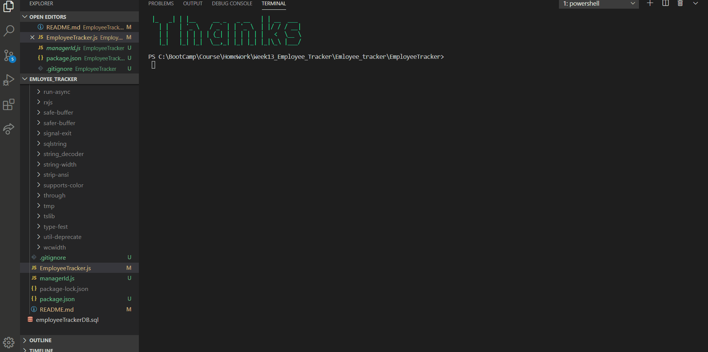

# EmployeeTracker

Architect and building a solution for managing a company's employees using node, inquirer, and MySQL.

# Project Title: Employee Tracker

# Email Address

luta_atul@hotmail.com

Table of Contents:

[Description](#Description:)

[Installation](#Installation:)

[SQL](#SQL:)

[Usage](#Usage:)

[Licence](#Licence:)

[Contributing](#Contributing:)

[Screenshots](#Screenshots:)

[References](#References:)

# Description:

This application is a solution for managing a company's employees using node, inquirer, and MySQL. This is a command line interface to do the following tasks:
"View All Employees",
"View All Departments",
"View All Roles",
"View All Employees by Department",
"View All Employees by Manager",
"Add Department",
"Add Role",
"Add Employee",
"Update Employee Role",
"Remove Employee",
"Remove Role",
"Remove Department",
"Update Employee Manager",
"View Total Utilized Budget of a Department"

# Installation:

Navigate to following folder

https://github.com/atulsd/EmployeeTracker

Clone the Repo

To view the web pages go to the following link

https://atulsd.github.io/EmployeeTracker/

# SQL

https://github.com/atulsd/EmployeeTracker/blob/master/employeeTrackerDB.sql

# Contributing

This is an open source project and is avaiable for anyone with a reference to it.

# Usage

This application is a **C**ontent **M**anagement **S**ystem for managing a company's employees.

# Licence

# Screenshots

# References:

MYSQL Foreign Keys: https://dev.mysql.com/doc/mysql-tutorial-excerpt/5.7/en/example-foreign-keys.html

MYSQL Calculate Days: https://dev.mysql.com/doc/mysql-tutorial-excerpt/5.7/en/calculating-days.html

https://dev.mysql.com/doc/refman/8.0/en/integer-types.html

https://www.google.com/search?q=can+you+have+foreign+key+of+the+primary+key+in+the+same+table+MYSQL&rlz=1C1CHBF_en-GBAU883AU883&oq=can+you+have+foreign+key+of+the+primary+key+in+the+same+table+MYSQL&aqs=chrome..69i57.14583j0j7&sourceid=chrome&ie=UTF-8

MYSQL Tutoriails for JOIN: https://sqlbolt.com/

Console.table: https://developer.mozilla.org/en-US/docs/Web/API/Console/table

Delete Data with Foreign Keys: https://stackoverflow.com/questions/8251146/delete-data-with-foreign-key-in-sql-server-table

On Delete Cascade: https://www.mysqltutorial.org/mysql-on-delete-cascade/
